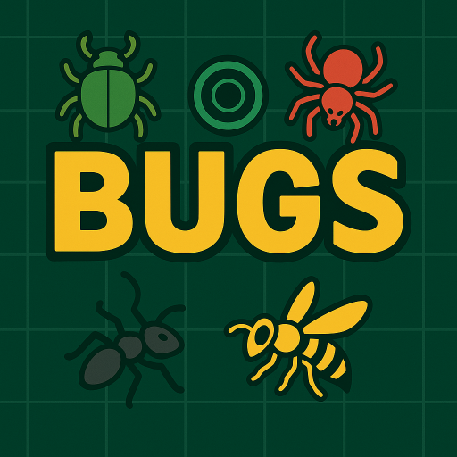
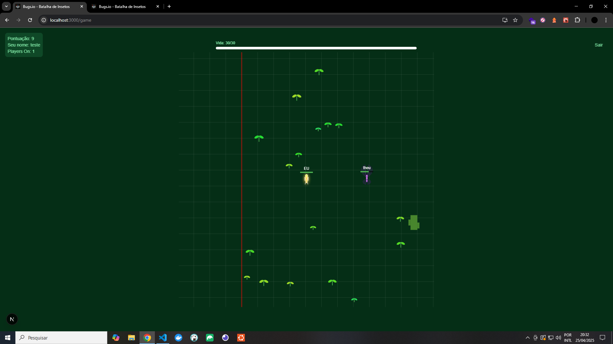
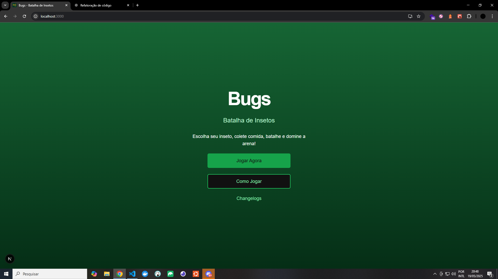
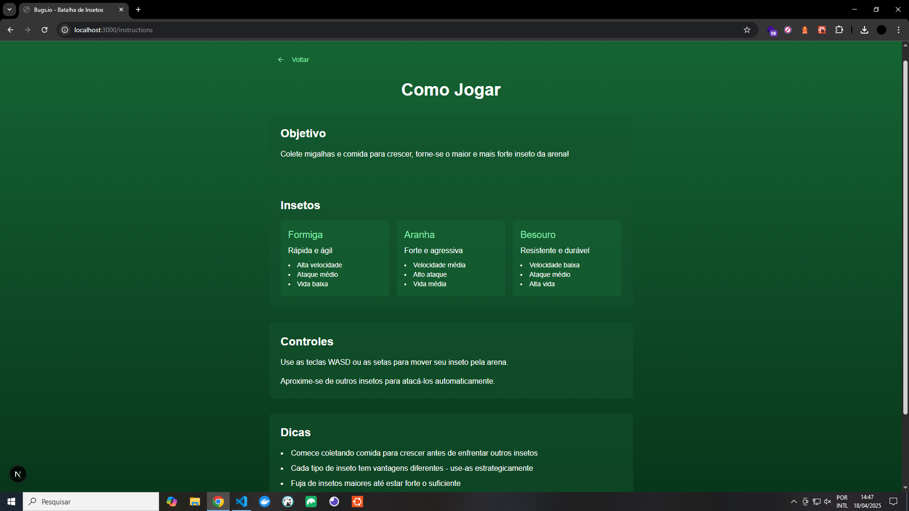
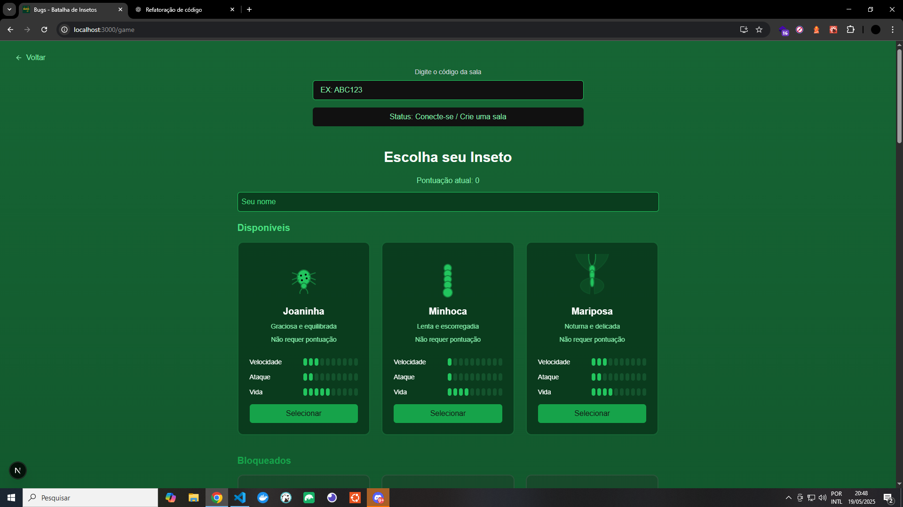

[](https://twitter.com/t_h_e_u)
[](https://www.linkedin.com/in/matheusgbatista/)
[](https://t-heu.github.io)

## Getting Started

First, run command:

```bash
npm install
```

Second, run the development server:

```bash
npm run dev
```

Open [http://localhost:3000](http://localhost:3000) with your browser to see the result.

## Learn More



"Bugs" é um minigame de ação em tempo real onde o jogador controla um inseto em um campo de batalha (arena) cheio de outros bots controlados por IA. O objetivo é coletar comida espalhada pelo mapa, crescer em tamanho e enfrentar outros insetos em combates estratégicos.

## 🖼️ Preview





## Cálculo de "requiredScore"

Fórmula de poder relativa para calc. "requiredScore".

poder = (speed * 0.5) + (attack * 1.2) + (health * 0.3)

Tier 0: até ~25 de poder → requiredScore: 0
Tier 1: 25–30 → requiredScore: 200–400
Tier 2: 30–35 → requiredScore: 500–700
Tier 3: 35–42 → requiredScore: 800–1000
Tier 4: 42–46 → requiredScore: 1100–1300
Tier 5: 46+ → requiredScore: 1400+
