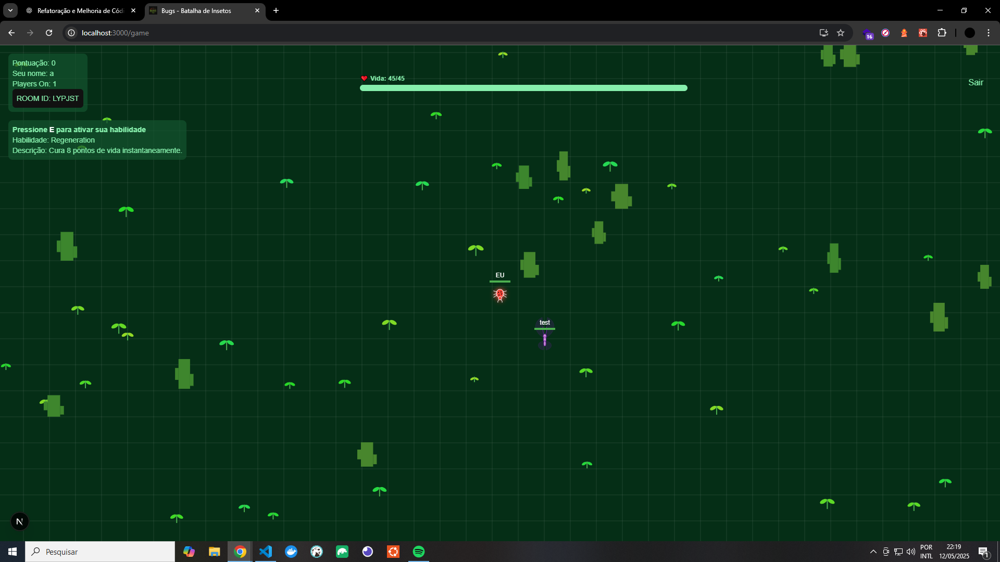
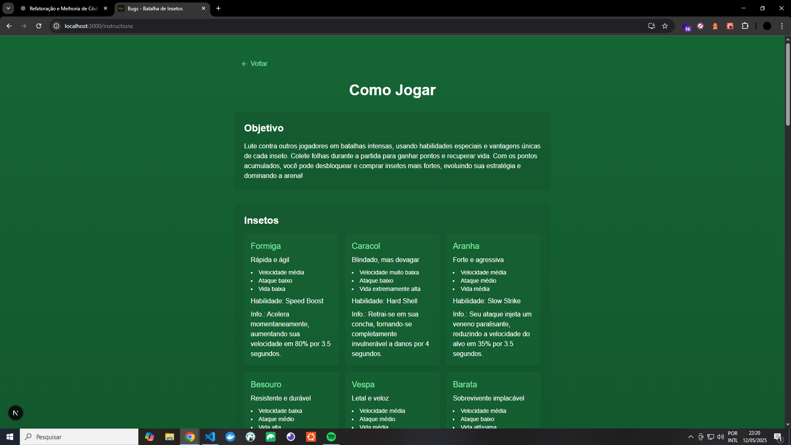

[](https://twitter.com/t_h_e_u)
[](https://www.linkedin.com/in/matheusgbatista/)
[](https://t-heu.github.io)

## Getting Started

First, run command:

```bash
npm install
```

Second, run the development server:

```bash
npm run dev
```

Open [http://localhost:3000](http://localhost:3000) with your browser to see the result.

## Learn More


"Bugs.io" é um minigame de ação em tempo real onde o jogador controla um inseto em um campo de batalha (arena) cheio de outros bots controlados por IA. O objetivo é coletar comida espalhada pelo mapa, crescer em tamanho e enfrentar outros insetos em combates estratégicos.

## 🖼️ Preview



